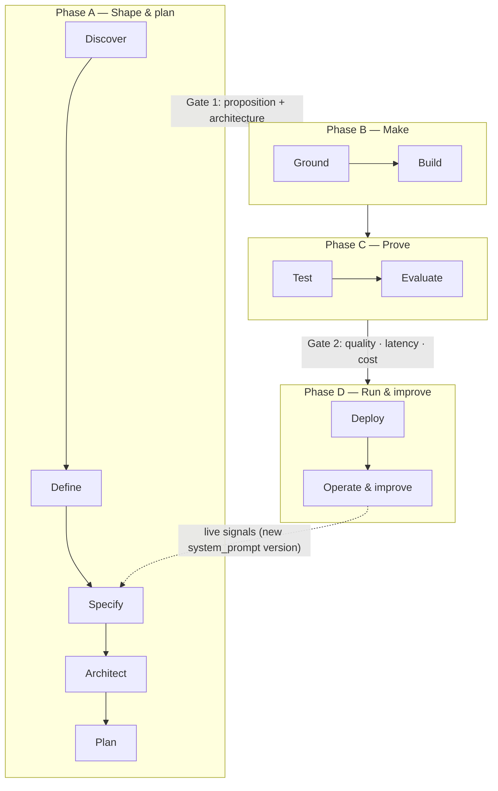

# 01 · System overview

## What it is

The Agent Platform is a **product factory for AI agents**. You bring a problem;
the platform walks it through 11 stages — research, definition, specification,
architecture, planning, knowledge grounding, building, testing, evaluation,
deployment, and continuous operation — and out the other side is a **live,
governed, self-improving agent** whose every answer can be traced back to the
exact knowledge it used.

It is one **backbone** (shared spine + console + auth + lineage) carrying two
products:

- **Agent Platform** — the 0 → live → improve pipeline (this documentation).
- **Academy** — per-stage enablement + courses, riding the same console shell.

## The looped pipeline

11 stages, 4 phases, 2 human gates, 1 feedback loop.



Each stage **reads** the artifacts of earlier stages and **writes** its own, so
the whole journey is a connected, versioned graph.

## Core concepts

### The golden thread (artifact lineage)
Every stage emits a **versioned, parent-linked artifact** under a project. The
result is a DAG you can render, diff, and roll back. The artifact chain:

```
opportunity → proposition → scope → {system_prompt, kb_outline}
   → kb_release → agent_version → {deployment, eval_run}
   (Architect emits adr; Plan emits plan; the gates emit gate1/gate2;
    Operate emits a new system_prompt version that re-enters the loop)
```

Lineage is **append-only**: a new fact is a new artifact version (never an
in-place edit), enforced at the database level.

### The provenance tuple
Every agent answer returns
`{release_key, agent_version, item_id, revision_id, chunk_id}` — the join key
between the *build-time* spine (which knowledge release + agent version) and the
*runtime* spine (which exact item, revision and chunk grounded the answer). This
is what makes answers auditable.

### Canonical store + projections
The Ground service holds **one canonical, governed source of truth** (items →
revisions → chunks). Vector (pgvector), lexical (tsvector) and graph (entity
index) are **rebuildable projections** over it, never parallel sources of truth.
An agent picks its retrieval mode per `agent_version`.

### The two gates
- **Gate 1** (end of Shape & plan): a proposition must be signed off **and** an
  ADR must exist before Make begins.
- **Gate 2** (end of Prove): the latest evaluation must pass the project's
  quality/latency/cost thresholds before Deploy is allowed.

### Governance, on by default
- Ingest runs **safety scans** and creates **submitted** revisions; a *different*
  actor must approve them (**four-eyes**); releases pin only approved content.
- The runtime applies **guardrails** on every turn: prompt-injection is blocked +
  escalated, PII is redacted before it reaches the model.

### The feedback loop
A deployed agent logs every turn. The **Operate** stage reads those live logs,
diagnoses weak interactions, and auto-proposes an **improved system prompt** —
emitted as a new artifact version that re-enters the pipeline. The loop closes.

## What you can do today

- Scope a topic → ground it (any of 6 retrieval modes, governed release) → build
  an agent (any of 4 paradigms) → prove it (multi-persona test + quality/latency/
  cost eval gate) → deploy it (≥2 targets, guardrails on, provenance on every
  answer) → operate it (live logs produce an accepted improvement that re-enters
  the pipeline). Academy provides per-stage help throughout.

## Honest scope (what's minimal vs production)

The platform is **minimal-but-real**: every stage works end-to-end and is
verified, but some components are deliberately lightweight, with production depth
deferred (see [02 · Architecture](02-architecture.md#deferred-depth)). Notably:
embeddings use a dependency-free hash function (real model swaps in behind one
seam), graph retrieval uses a token entity-index (not Neo4j), build paradigms are
authoring surfaces over one shared RAG runtime, connectors are RSS + web, and
guardrails are regex/heuristic (not Presidio/OPA).
