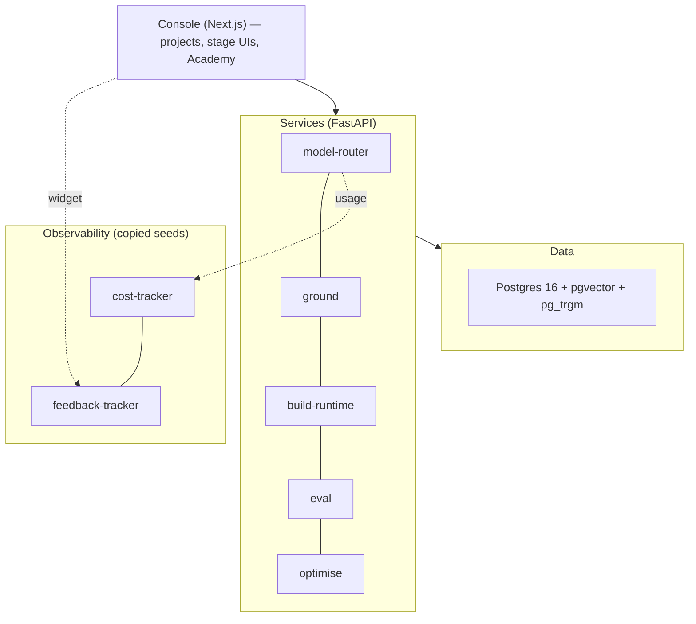

# 02 · Architecture

## Layers



The **console never talks to a service from the browser**. Every call goes through
a Next.js route handler (server-side), which resolves the dev-stub session and
injects trusted `X-AP-User` / `X-AP-Role` headers. Service URLs and provider keys
stay off the client.

## Services and ports

| Service | Port | Stack | Responsibility |
|---|---|---|---|
| **console** | 3000 | Next.js 15 (App Router) + React 19 + Tailwind + shadcn-style | All UI; proxies to services; dev-stub auth + RBAC. |
| **model-router** | 8789 | FastAPI + LiteLLM | One seam over all LLM providers + prompt/version registry; emits cost/latency. |
| **ground** | 8790 | FastAPI + SQLAlchemy | Governed canonical store; ingest/connectors; 6 retrieval modes; pins releases. |
| **build-runtime** | 8791 | FastAPI | Builds `agent_version` (4 paradigms); RAG chat; runtime guardrails; chat logging. |
| **eval** | 8792 | FastAPI | Test-set generation; multi-persona run; quality/latency/cost; policy + Gate 2. |
| **optimise** | 8793 | FastAPI | Operate loop: detect → diagnose → prescribe over live logs. |
| **cost-tracker** | 8787 | FastAPI + SQLite | Per-app burn-rate dashboard (copied seed, run as-is). |
| **feedback-tracker** | 8788 | FastAPI + SQLite | In-UI feedback widget + triage (copied seed). |
| **Postgres** | 5433 | `pgvector/pgvector:pg16` (Docker) | Canonical + lineage store. Host **5433** to avoid a local Postgres on 5432. |

All five platform FastAPI services are **virtual `uv` workspace members** run via
`uvicorn app.main:app --app-dir services/<name>` (avoids a top-level `app`
package clash). See the `Makefile` targets.

## Monorepo layout

```
e2e-agent-platform/
├── apps/console/            Next.js shell + all stage UIs + Academy
├── services/
│   ├── model-router/        wraps LiteLLM + prompt registry        (app/)
│   ├── ground/              canonical store + retrieval            (app/)
│   ├── build-runtime/       agent build + RAG chat + guardrails    (app/)
│   ├── eval/                test/eval/Gate 2                       (app/)
│   ├── optimise/            operate loop                           (app/)
│   ├── cost-tracker/        copied seed (server/ client/)
│   └── feedback-tracker/    copied seed (server/ client/ widget/)
├── packages/                shared TS libs
│   ├── design-system/       Lloyds tokens → Tailwind preset + primitives
│   ├── lineage-client/      TS artifact/project client
│   ├── model-router-client/ typed client for the router
│   ├── cost-client/         (placeholder)
│   └── feedback-widget/     loader for the collector-served widget
├── py/                      shared Python libs
│   ├── lineage/             Python artifact/project client (identical contract)
│   ├── providers/           embedding adapter (hash placeholder)
│   └── governance/          PII + injection scanners
├── db/migrations/           Postgres SQL (0001–0012) + runner
├── infra/                   docker-compose (Postgres + spine services)
└── scripts/                 seed-phase*.sh, verify-m*.sh, verify-all.sh
```

## Tech stack (decided)

| Concern | Choice |
|---|---|
| UI | Next.js (App Router) + React 19 + Tailwind 3 + a design-system from Lloyds tokens |
| Services | Python 3.12 + FastAPI |
| Canonical/lineage store | Postgres 16 + **pgvector** + **pg_trgm** |
| Model access | **model-router** wrapping **LiteLLM** + a prompt/version registry |
| Embeddings | feature-hash placeholder in `py/providers` (swap a real model here) |
| Auth | **dev-stub** behind a single `getSession()` seam (`SESSION_PROVIDER`); 7-role RBAC |
| Repo | pnpm workspaces (TS) + `uv` workspace (Python) |

## The model router

No stage calls a provider SDK directly. The router (`services/model-router`):

- **Wraps LiteLLM** so switching provider/model needs no stage change.
  Logical model ids (`claude-haiku-4-5`, `claude-sonnet-4-6`, `claude-opus-4-8`)
  map to LiteLLM model strings and to the cost-tracker pricing table.
- Hosts a **prompt/version registry** (`prompt`, `prompt_version` tables). Every
  LLM call references a `(prompt_key, version)`; the active version is used unless
  one is pinned. Activate = rollback by activating a prior version.
- **Auto-accounts**: every `/v1/route` call emits tokens + cost + latency to
  cost-tracker via its fire-and-forget Python client (never blocks the call).

Prompts seeded into the registry: `specify.spec`, `agent.answer`, `eval.judge`,
`discover.opportunity`, `define.proposition`, `plan.plan`, `agent.generate_config`,
`test.suite`, `operate.improve` (see `scripts/seed-phase*.sh`).

## Governance & guardrails

- **py/governance** scanners: PII (email/card/UK-phone/sort-code regex) +
  prompt-injection heuristic + `redact_pii`.
- **Ingest-time** (Ground): each ingest runs the scanners, stores `scan_results`,
  and creates a **submitted** revision; a different actor must **approve**
  (four-eyes); releases pin only approved revisions.
- **Runtime** (build-runtime chat): on every turn, injection → block + escalate,
  PII → redact before the model. Returns a `guardrails` result.
- **policy_bundle** holds per-project `pre_deploy_gates`; **Gate 2** enforces them
  before deploy.

## Observability

- **cost-tracker** — every router call lands here automatically (tokens, cost,
  latency). The console embeds its dashboard in the project **Cost** tab.
- **feedback-tracker** — the browser widget floats over every console route.
- **lineage / chat_log** — append-only artifacts + per-turn chat logs (the signal
  the Operate loop learns from).

## A request, end to end (chat)

```
Browser → POST /api/chat (console route handler; injects identity)
        → build-runtime POST /v1/chat
            → guardrails: scan_injection (block?) / redact_pii
            → ground POST /v1/retrieve (mode = agent_version.retrieval_strategy)
            → model-router POST /v1/route (prompt "agent.answer")  → cost-tracker
            → write chat_log row (top score, flagged?)
            → return {answer, provenance tuple, citations, guardrails, cost, latency}
```

## Deferred depth

Per the build sequence, production depth is intentionally deferred. The current
implementation vs. the production target:

| Area | Now | Production target |
|---|---|---|
| Embeddings | feature-hash (offline, deterministic) | a real embedding model behind `py/providers` |
| Graph retrieval | token entity-index in Postgres | Neo4j / Apache AGE + graph-enricher |
| Build paradigms | authoring surfaces over one RAG runtime | full LangGraph/ADK/flexi/VCBL runtimes (AF) |
| Connectors | RSS + web | GitHub, Confluence/Jira, STT/audio, broadened OCR |
| Guardrails | regex PII + injection heuristic | Presidio, OPA policy, trained risk classifier |
| Deploy targets | logical (deployment artifact + guard policy) | real push to Vercel/GCP/Azure/Watson/… |
| Auth | dev-stub behind `getSession()` | OIDC SSO via an IdP (same seam) |
| Spine stores | cost/feedback on SQLite | Postgres if multi-writer scale demands |

Each is isolated behind a seam, so upgrading one does not ripple across stages.
