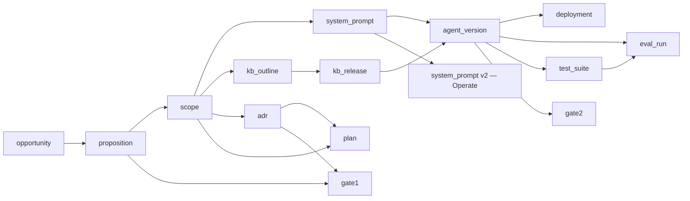

# 03 · Data model & lineage

All state lives in Postgres (`agent_platform` on port 5433). Schema is created by
forward-only SQL migrations in `db/migrations/0001…0012` (`make migrate`).

## The lineage core

```sql
project(id uuid pk, slug unique, name, domain, owner, status, created_at)

artifact(
  id uuid pk, project_id fk, type text, version int,
  status text,                         -- draft | approved | superseded
  payload jsonb, created_by, created_at,
  UNIQUE (project_id, type, version)   -- immutable append: never UPDATE payload
)

artifact_parent(child_id fk, parent_id fk)   -- the lineage DAG
```

**Invariants (enforced at the DB + client level):**
- *Immutable append.* A new fact is a new `artifact` row with `version = max+1`
  for `(project, type)`. `payload` is never updated; the only mutation is a status
  transition (`draft → approved → superseded`).
- *`parents` is required at write time* (may be `[]` for a genesis artifact).
- *Console edits obey the same rule.* The UI's **Edit** action (`POST
  /api/artifacts`) never mutates a payload — it appends a new version of the same
  type, parented on the artifact that was edited, written by the acting user and
  recorded in the audit chain.

The TS client (`packages/lineage-client`) and the Python client (`py/lineage`)
implement an **identical contract** — `createProject`, `createArtifact`,
`approveArtifact`, `getLineage`, `diffArtifacts` — verified by a shared contract
test on both sides.

## Artifact types and payloads

Every stage writes one (or more) of these. `payload` shapes:

| `type` | Stage | Payload (shape) |
|---|---|---|
| `opportunity` | Discover | `{problem, evidence[], marketNotes, feasibilityScore, uncertaintyScore, status}` |
| `proposition` | Define | `{targetUser, need, capabilities[], successMetrics[], tovDirection, feasibilityCheck, compliancePrecheck, status}` |
| `scope` | Specify | `{topic, outline:[{title, children[]}]}` |
| `system_prompt` | Specify / Operate | `{text, improved_from?, rationale?, source?}` |
| `kb_outline` | Specify | `{topics:[…]}` |
| `adr` | Architect | `{buildParadigm, runtime, retrievalStrategy, storageProjections[], channels[], deployTarget, guardrailPolicyRef?}` |
| `plan` | Plan | `{epics:[{summary, stories:[{summary, tasks[], points}]}], resourcing[], csv}` |
| `gate1` | Gate 1 | `{decision, proposition_id, adr_id}` |
| `kb_release` | Ground | `{release_key, item_revisions:[{item_id, revision_id}], content_hash, retrieval_indexes[]}` |
| `agent_version` | Build | `{build_paradigm, runtime, retrieval_strategy, release_key, kb_release_artifact_id, system_prompt_artifact_id, config}` |
| `test_suite` | Test | `{personas:[{name, style}], tags[], cases:[{utterance, expected, tags[], persona, difficulty}]}` |
| `eval_run` | Evaluate | `{source, metrics:{quality, latency_ms, cost_usd}, perCase[], perPersona, gateResult}` |
| `gate2` | Gate 2 | `{decision, metrics, gates}` |
| `deployment` | Deploy | `{agent_version_id, target, channels[], guardrail_policy, runtime_guards[], provenance:true, status}` |

### The golden-thread DAG



## The canonical store (Ground)

The single source of truth for knowledge. pgvector/tsvector/entity indexes are
**projections** over it.

```sql
kb_item(id, project_id fk, uri, title, created_at, UNIQUE(project_id, uri))

kb_revision(                          -- immutable; governed
  id, item_id fk, rev_number, body, content_hash,
  state text,                         -- submitted | approved | rejected
  submitted_by, approved_by, scan_results jsonb,
  UNIQUE(item_id, rev_number))

kb_chunk(
  id, revision_id fk, chunk_index, heading_path, body,
  embedding vector(384),              -- pgvector projection
  UNIQUE(revision_id, chunk_index))

kb_chunk_entity(chunk_id fk, entity text)   -- graph projection (PK chunk_id+entity)

kb_release(id, project_id fk, release_key, item_revisions jsonb, content_hash)
```

**Releases pin only `state='approved'` revisions** — the four-eyes gate. Retrieval
is scoped to a release's revision set.

## Build, deploy, governance, registry

```sql
agent_version(id, project_id fk, version, build_paradigm, runtime,
              retrieval_strategy, kb_release_id?, system_prompt_artifact_id?, config jsonb)
deployment(id, project_id fk, agent_version_id?, target, channels jsonb,
           guardrail_policy_id?, status)
policy_bundle(id, project_id fk, pii, injection, classification, risk_classifier,
              opa_rules jsonb, pre_deploy_gates jsonb, runtime_guards jsonb)
prompt(id, key unique, name, created_at)
prompt_version(id, prompt_id fk, version, template, default_model, is_active,
               UNIQUE(prompt_id, version))   -- partial-unique: one active per prompt
```

> Note: `agent_version`, `deployment`, `kb_release` exist both as **lineage
> artifacts** (the DAG) and as **typed tables** (the operational record). The
> Build/Deploy/Ground flows write the artifact; the typed tables back the runtime
> (e.g. `kb_release.item_revisions` scopes retrieval).

## Operate & Academy

```sql
chat_log(id, project_id fk, agent_version_id fk, question, answer,
         top_score real, flagged bool, created_at)     -- the Operate signal
academy_progress(user_id, role_path, stage_id, completed_at,
                 PK(user_id, role_path, stage_id))
```

## The provenance tuple

Returned on **every** agent answer:

```json
{ "release_key": "kb-20260614-1", "agent_version": 1,
  "item_id": "…", "revision_id": "…", "chunk_id": "…" }
```

- `release_key` + `agent_version` — the **build-time** identity (which knowledge
  release, which agent build).
- `item_id` + `revision_id` + `chunk_id` — the **runtime** identity (the exact
  governed chunk that grounded the answer).

Together they let you answer "why did the agent say this?" and trace it back
through the lineage to a signed-off source revision.
