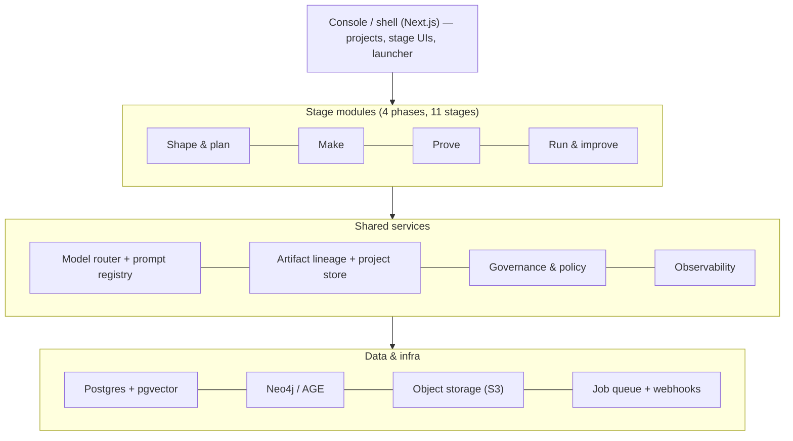
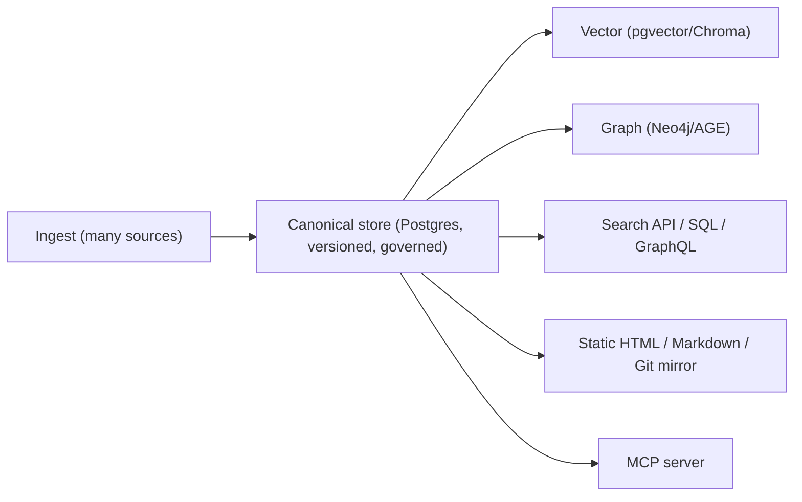

# 00 · Architecture

The target shape of the Agent Platform. This is the contract every stage builds against.

## Layers



## Tech stack (decided — see 05 for the open trade-offs)

| Concern | Decision | Why |
|---|---|---|
| UI | **Next.js (App Router) + React + Tailwind + shadcn/ui** | Most UIs already are (scope-maker, chat-eval, jira-builder, A-level, VCBL, AF UI, flexi UI). Port the Gradio / Svelte / Vue / Flask / Express UIs into this one console. |
| AI/RAG/ML services | **Python 3.12 + FastAPI** | KMS scraper, AF, flexi, graphBOT, graph-enricher, intent-optimiser, customer-facing are already Python. |
| KMS API | **Node 22** (as built) initially; evaluate folding into the Python service layer later | KMS is the kernel and is Node; don't rewrite it on day one. |
| Canonical store | **Postgres 16 + pgvector + pg_trgm** | KMS already targets this; gives lexical FTS + vector in one engine. |
| Graph projection | **Neo4j** (or **Apache AGE** in Postgres to start) | graphBOT/graph-enricher use Neo4j; AGE removes an extra service for small instances. |
| Vector projection | **pgvector** primary; **Chroma** optional adapter | One store by default (graphBOT uses Chroma — keep as adapter). |
| Object storage | **S3-compatible** | Raw snapshots, document originals, export bundles, audit WORM mirror. |
| Eventing/jobs | **Postgres-backed queue (pg-boss / Celery)** + webhooks | KMS already uses Postgres-backed workers; webhooks for `item.published`, `release.cut`, etc. |
| Auth | **OIDC SSO + RBAC** (KMS roles: viewer/contributor/steward/approver/taxonomy_manager/admin/compliance_approver) | KMS already defines the role model; reuse platform-wide. |
| Model access | **Model router service** (see below) | Single seam over all providers + prompt/version registry. |
| Repo | **Polyglot monorepo** (pnpm workspaces + uv/poetry Python workspace) | One versioned tree; shared TS + Python packages. |

## Monorepo layout

```
agent-platform/
├── apps/
│   ├── console/                # Next.js shell: projects, launcher, hosts all stage UIs as routes
│   └── academy/                # course catalog + per-stage enablement (shares console shell/auth/design-system)
├── services/                   # Python FastAPI services
│   ├── ground/                 # KMS kernel + graphBOT serve + graph-enricher + scrapers
│   ├── build-runtime/          # LangGraph + ADK + flexi runners; generative builder
│   ├── eval/                   # chat-eval engine + DeepEval + latency/cost
│   ├── optimise/               # intent-optimiser + rewriter self-improve loop
│   └── model-router/           # provider abstraction + prompt/version registry
├── services-node/
│   └── kms-api/                # existing knowledge-management-system API (kept as-is initially)
├── packages/                   # shared TypeScript libs
│   ├── design-system/          # from lloyds-design (tokens + components)
│   ├── lineage-client/         # read/write artifacts + project model
│   ├── model-router-client/    # typed client for the router
│   ├── cost-client/            # cost-tracker client (existing Python client has a TS twin)
│   └── feedback-widget/        # feedback-tracker browser widget + SDK
├── py/                         # shared Python libs
│   ├── lineage/                # artifact + project ORM (SQLAlchemy/Prisma-py)
│   ├── governance/             # PII (Presidio), injection, classification, OPA policy
│   └── providers/              # embedding + LLM provider adapters
├── db/                         # Postgres migrations (canonical store + lineage + governance)
└── infra/                      # docker-compose (dev), deploy manifests
```

## The artifact-lineage "golden thread"

The single most important architectural feature: every stage emits a **versioned artifact** linked to its parents, so the whole journey is traceable, diffable and rollback-able. Unifies KMS release-pinning + provenance tuples, experiment-mgmt `EX-NNN` IDs, and requirement IDs.

```
Project (workspace)
  └── Artifact (versioned, parent-linked)
        proposition → scope → system_prompt → kb_outline → tov_overlay
        → constraints → adr → plan → kb_release → agent_version
        → test_suite → eval_run → deployment
```

Core schema (Postgres):

```sql
project(
  id uuid pk, slug text unique, name text, domain text,
  owner text, status text, created_at timestamptz
)

artifact(
  id uuid pk, project_id uuid fk, type text,        -- proposition|scope|system_prompt|...
  version int, status text,                          -- draft|approved|superseded
  payload jsonb, created_by text, created_at timestamptz
)
artifact_parent(child_id uuid fk, parent_id uuid fk) -- the lineage DAG

kb_release(
  id uuid pk, project_id uuid fk, release_key text,  -- e.g. "kb-2026-06-14"
  item_revisions jsonb, content_hash text, created_at timestamptz
)

agent_version(
  id uuid pk, project_id uuid fk, version int,
  build_paradigm text,        -- langgraph|adk|code|canvas|generative
  runtime text, retrieval_strategy text,             -- vector|lexical|hybrid|graph|graph_hybrid
  kb_release_id uuid fk, system_prompt_artifact_id uuid fk,
  config jsonb, created_at timestamptz
)

deployment(
  id uuid pk, project_id uuid fk, agent_version_id uuid fk,
  target text,                -- gcp|azure|local|vercel|sharepoint|watson|dialogflow|liveperson|openclaw
  channels jsonb, guardrail_policy_id uuid fk, status text, created_at timestamptz
)
```

**Serve-time provenance tuple** (returned with every agent answer): `{release_key, agent_version, item_id, revision_id, chunk_id}` — the join key between the build-time spine and the runtime spine.

## Ground: canonical-store + projections law

One law, non-negotiable: **the canonical store is the only source of truth; everything else is a rebuildable projection.**



Retrieval strategy is chosen **per agent_version** (`retrieval_strategy` column), and may combine projections (hybrid = vector + lexical RRF; graph-hybrid = vector entry + 1-hop subgraph). Adding/changing a projection never edits the source.

## Model router & prompt/version registry

A single service so no stage talks to a provider SDK directly:

- **Providers (adapters):** Anthropic, Google Gemini/Vertex, OpenAI, xAI Grok, Ollama/local, OpenRouter, plus the long tail (Nous/Qwen/MiniMax/HF/Groq/Atlas).
- **Prompt registry:** versioned prompts (create/activate/rollback) — unifies AF Jinja2 versioning, VCBL's 14 templates, rewriter-admin chains. Every LLM call references `(prompt_id, version)`.
- **Accounting:** every call emits tokens + cost + latency to the observability spine (so cost/latency show up in eval and dashboards for free).

## Governance & policy (on by default, configurable)

A policy bundle per project, enforced across stages:

```
policy_bundle(
  id uuid pk, project_id uuid fk,
  pii bool, injection bool, classification bool, risk_classifier bool,
  opa_rules jsonb,                 -- pre_authorize + final_gate
  pre_deploy_gates jsonb,          -- eval thresholds: quality|latency|cost
  runtime_guards jsonb             -- step_up, escalation, never_cross_customer, free_text_never_executes
)
```

- **Scanners** (`py/governance`): PII (Presidio + UK regex), prompt-injection heuristics, classification guard — from KMS + customer-facing.
- **Where enforced:** Specify (capture constraints) → Ground (ingest scans + four-eyes approval) → Build (attach policy) → Evaluate (gates) → Deploy (runtime guards) → audit everywhere (hash-chained).
- **openclaw is not used here.** Governance is KMS + customer-facing only.

## Observability spine

- **cost-tracker** — per-project/model burn-rate; fed automatically by the model router.
- **feedback-tracker** — in-UI feedback (FTS, sentiment, triage) across all stage UIs.
- **Lineage/audit** — append-only audit events keyed by project + artifact; latency waterfalls from the router.

## Tech-consolidation strategy (the real migration cost)

The source apps span Next.js, FastAPI, Flask, Gradio, Svelte, Vue, Electron, Express. The plan:

- **UIs → Next.js console.** Port Gradio (CHATBOT_TEST_SET_GENERATOR), Svelte (EPM), Vue (customer-facing), Flask UIs (ally, intent-optimiser front-ends), Express (text-to-voice) into console routes. The *logic* mostly lives in the backends — porting is mostly view-layer.
- **Backends → FastAPI services**, except KMS (Node) kept as-is initially behind the service mesh.
- **Electron (hermes)** stays a separate desktop client that talks to the same services (it's a deploy/operate surface, not part of the console).
- **Standalone Python pipelines** (graphBOT, graph-enricher, simple-scraper) become library modules or jobs inside `services/`.

This consolidation is itself a workstream — see `02-build-sequence.md` Phase 0 and the per-app verdicts in `01-seed-mapping.md`.

## Academy on the backbone

Academy is a second product on the same spine — not a separate stack:

- **Shares** the console shell, design-system, OIDC auth, and the observability spine (cost/feedback).
- **Adds** a course-player + a progress store (its own tables; preserves the existing anonymous localStorage namespaces `awd-`/`kb-`/`oc-`/`pdc-`, plus accounts for graded A-level).
- **Reads live from the platform**: per-stage enablement (how-it-works, guides, training) is generated from / linked to the actual stage modules, so docs never drift from the UI.
- **Authoring aids** scope-maker and prompt-improver are shared with the Agent Platform's Specify stage.

Resonate and Mission Control are **not** on this backbone and are not addressed by this architecture.
