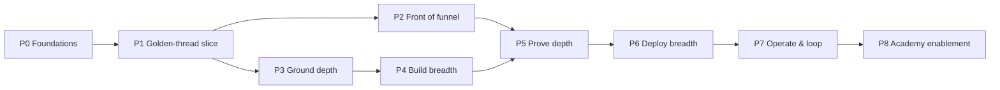

# 02 · Build sequence

The order to actually build it. Each phase has a goal, the work, dependencies, and a **milestone with acceptance criteria** (a demoable proof). Do not start a phase before its dependencies are green.

---

## Phase 0 — Foundations (the spine + walking skeleton)
**Goal:** the backbone exists; nothing product-specific yet.
- Monorepo scaffold (`apps/`, `services/`, `services-node/`, `packages/`, `py/`, `db/`, `infra/`).
- Console shell (Next.js) + `packages/design-system` (from lloyds-design) + OIDC auth + RBAC roles.
- **Project/workspace model + artifact-lineage store** (db migrations: `project`, `artifact`, `artifact_parent`, `kb_release`, `agent_version`, `deployment`).
- **Model-router service** + prompt/version registry; every call emits tokens/cost/latency.
- Spine wired: cost-tracker + feedback-tracker services up; feedback widget in the console.
- Governance scaffolding: `policy_bundle` table + `py/governance` scanners stubbed (PII/injection/classification interfaces).
- **Dependencies:** none.
- **Milestone M0:** create a Project in the console → it persists → the model router answers a "hello" call → cost + latency show in the dashboard. RBAC blocks an unauthorised role.

## Phase 1 — Golden-thread thin slice (prove the pipeline end-to-end)
**Goal:** one project goes scope → KB → agent → chat → eval, with every step linked in the lineage. The single most important phase — it de-risks everything.
- **Ground (minimal):** KMS ingest a few docs → canonical store → pgvector → vector RAG + MCP serve. (No graph, no governance workflow yet.)
- **Specify:** scope-maker → emits `scope`, `system_prompt`, `kb_outline` artifacts.
- **Build:** one runtime only — LangGraph via AF — consuming `system_prompt` + a pinned `kb_release`; emits an `agent_version`.
- **Deploy:** one channel — web chat via the ally widget; emits a `deployment` with the provenance tuple.
- **Evaluate:** chat-eval minimal (one Judge node) on a handful of transcripts.
- **Dependencies:** P0.
- **Milestone M1:** scope a topic → ingest docs → build a vector-RAG agent → chat with it → run an eval — all five artifacts linked parent→child in the lineage, and the answer carries `{release_key, agent_version, item_id, revision_id, chunk_id}`.

## Phase 2 — Front of funnel (Shape & plan)
**Goal:** the journey starts at research, not at scope.
- **Discover:** experiment-mgmt (→ Postgres) + external-input/signal analysis (news.facts library) + research synthesis (news-agents pattern).
- **Define:** 🆕 research→proposition tool (on the experiment-mgmt seed).
- **Architect:** 🆕 ADR module.
- **Plan:** jira-ticket-builder (consume scope + ADR) + resource-planner (→ Postgres).
- **Gate 1** implemented (proposition + architecture sign-off; human go/no-go).
- **Dependencies:** P1 (needs the lineage + Specify).
- **Milestone M2:** idea → scored hypothesis → proposition (Gate 1) → scope → ADR → plan, all artifacts linked; Gate 1 blocks progression until signed off.

## Phase 3 — Ground depth (the kernel)
**Goal:** the knowledge kernel is production-grade and offers every retrieval mode.
- Full KMS governance: state machine, four-eyes + fast-lane, safety scans (PII/secrets/injection/classification), schema-registry, 3-layer tagging + confidence routing, **releases + time-travel + canary**, append-only audit + lineage, RBAC + domains + RLS, drift-guard.
- Graph projection (graphBOT serve) + KG enrichment (graph-enricher); **all retrieval modes** (vector, lexical, hybrid-RRF, graph lookup, graph traverse, graph-hybrid) selectable per `agent_version`.
- Ingest depth: simple-scraper crawl + per-domain/LLM cleaners; conflict/dedup checks against the corpus.
- 🆕 Connectors in order: **RSS** → **GitHub** → **Confluence/Jira** → **STT/audio transcription** + broadened OCR.
- **Dependencies:** P1 (Ground minimal).
- **Milestone M3:** ingest from web + docs + API + RSS → governed canonical store (four-eyes approval) → pick any retrieval mode per agent → pin a KB release an agent consumes.

## Phase 4 — Build breadth
**Goal:** every build paradigm produces an `agent_version`.
- flexi multi-agent runtime; VCBL conversational flows; visioXfable5 import; EPM LLM gateway; ADK runtime (from customer-facing).
- 🆕 **generative agent builder** — LAST, only after the deterministic paths above are proven, so generated agents have a baseline to validate against.
- **Dependencies:** P3 (build needs real Ground + retrieval).
- **Milestone M4:** build the same agent four ways (canvas, conversational flow, YAML multi-agent, generative) — each yields a valid `agent_version` that passes M1's chat+eval.

## Phase 5 — Prove depth
**Goal:** a real quality gate before any deploy.
- Test: test-set-gen (personas/coverage), regression (path + vision), AF synthetic, 🆕 multi-persona runner.
- Evaluate: full DeepEval 11 metrics, 🆕 latency + cost per run, evaluation-manager UX, flexible log import (system + external), customer-facing 4 eval-gate suites.
- **Gate 2** implemented (evaluation pass: quality · latency · cost).
- **Dependencies:** P2 + P4.
- **Milestone M5:** generate a multi-persona suite → eval with quality + latency + cost → Gate 2 blocks a failing agent and passes a good one.

## Phase 6 — Deploy breadth
**Goal:** flexible targets + channels with guardrails.
- Targets — prioritise **2 first** (recommend Vercel + GCP), then Azure / Local / SharePoint / Watson / Dialogflow / LivePerson.
- Channels — web/mobile/overlay (ally), then the 16 messaging gateways (hermes desktop client), agent-desk + human handoff (customer-facing), voice (TTS + 🆕 STT).
- Runtime guardrails ON by default (PII/injection/risk/OPA/step-up/escalation/audit) per `policy_bundle`.
- **Dependencies:** P5 (Gate 2 must exist before real deploys).
- **Milestone M6:** deploy one `agent_version` to 2 targets + 3 channels with runtime guardrails and provenance on every answer.

## Phase 7 — Operate & close the loop
**Goal:** the agent improves from real traffic.
- intent-optimiser (detect→diagnose→prescribe over live logs); rewriter-admin self-improvement loop (feedback→draft→test→judge→auto-promote).
- Wire live signals (cost/feedback/latency/eval-on-real-logs) back to Discover / Specify / Ground / Build.
- **Dependencies:** P6 (need a live agent producing logs).
- **Milestone M7:** a deployed agent's real logs produce an auto-improvement proposal that re-enters the pipeline as a new artifact version (closing the loop).

## Phase 8 — Academy enablement
**Goal:** the second product on the backbone.
- Course player + progress + gamification (generalise A-level-revision); import the static courses; workshop assets.
- 🆕 per-stage enablement (how-it-works/guides/training) mapped 1:1 to the 11 stages, reading live from the platform.
- **Dependencies:** stage UIs exist (P2–P7) so the enablement can reference them.
- **Milestone M8:** every stage has contextual help; a learner can follow a role path (e.g. Conversation Designer = Specify→Build→Test) end-to-end.

---

## Net-new sequencing (the 🆕 items, in dependency order)

1. **Artifact-lineage store + model router** (P0) — everything depends on these.
2. **research→proposition tool** (P2).
3. **ADR/architect module** (P2).
4. **Ground connectors**: RSS (P3) → GitHub/Confluence (P3) → STT (P3/P6).
5. **multi-persona runner** (P5) + **eval latency/cost** (P5).
6. **generative agent builder** (P4, gated behind deterministic build success) — highest risk, see `05-risks-open-questions.md`.
7. **Academy per-stage enablement** (P8).

## What is explicitly NOT in this sequence
Resonate and Mission Control (money/career). They are separate products; building them is out of scope for this plan.
