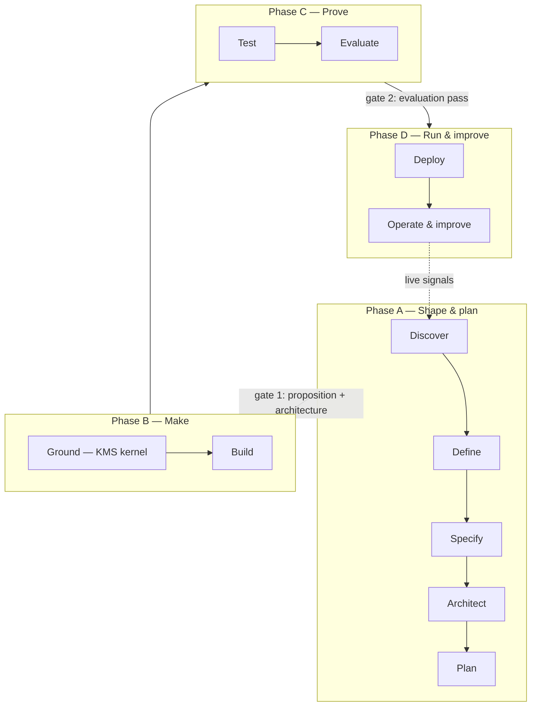

# Agent platform (+ Academy) — build plan

> **Start here.** This folder is a self-contained build plan for one **backbone** carrying **two products**: the **Agent Platform** (take an idea from 0 → a running, self-improving live agent) and **Academy** (course catalog + per-stage platform enablement). It is designed to be picked up cold by a new session/team with no prior context.

## Scope — what's on this backbone

The backbone = the shared **spine + console shell + auth + artifact lineage**. Two products ride it:

- **Agent Platform** — the 0 → live → improve pipeline (this folder's main subject).
- **Academy** — the existing course catalog **plus** per-stage user-guides / training / how-it-works for the platform, served inside the same console.

**Out of scope here (separate products, NOT on this backbone, NOT built by this plan):**
- **Resonate** — creative studio & arcade (DRUMS, eight-track-sequencer, dub-siren, viz-synth, DowerTefence, space-shooter, racer, dower_tefence_art).
- **Mission Control** — personal money + career (daily-stock-trader, soccer-pundit, EARNING_TIMER, j-search).

They keep their own blueprints in `../superapp-blueprints/` and stand alone.

> Important: the delivery tools **experiment-management-system, scope-maker, jira-ticket-builder, resource-planner** are **part of the Agent Platform** (Discover/Plan stages) — they are *not* Mission Control. "Mission Control" here means only the money + career apps, which are out of scope.

## What we're building (Agent Platform)

**11 stages, 4 phases, 2 human gates, 1 feedback loop.** The agent is a product that keeps learning from real traffic.

## The decisions already locked (do not relitigate without reason)

1. **It's a loop**, ending in *operate & continuously improve*; live signals re-enter Discover/Specify/Ground/Build.
2. **knowledge-management-system is the kernel.** One canonical store; graph / vector / SQL / GraphQL / flat are *projections*, never parallel sources of truth. Every retrieval mode (vector, lexical, hybrid-RRF, graph lookup, graph traverse, graph-hybrid) is preserved as a per-agent choice.
3. **Governance is on by default, configurable per instance** — built from KMS four-eyes + customer-facing PII/risk/OPA. **Not** from openclaw.
4. **openclaw is not central** — at most an optional output/deploy target.
5. **No functionality dropped.** Where two source apps did a job differently, both survive as options; where an app didn't fit, its capability was repurposed (e.g. news.facts clustering → "external-input analysis"). Only `theatre-scout` and `pod-to-mp3` are dropped/parked.
6. **Academy rides the same backbone**; Resonate and Mission Control are separate products, not built here.

## How to read this folder

| File | Purpose |
|---|---|
| `README.md` | This start-here overview + scope. |
| `00-architecture.md` | Monorepo, tech stack, data model, the artifact-lineage "golden thread", canonical-store + projections, model router, governance, observability, Academy-on-the-backbone, tech-consolidation strategy. |
| `01-seed-mapping.md` | For every stage, service and Academy module: **which existing app becomes the starting codebase**, its current stack/path, and the verdict (adopt / extend / port-UI / library-ify / kernel / new). Plus the explicit out-of-scope list. |
| `02-build-sequence.md` | Phased roadmap (Phase 0–8), milestones, dependencies, and the sequencing of the net-new builds. |
| `03-stage-specs.md` | Per-stage implementation spec: responsibility, source apps, reuse-vs-rebuild, **artifact inputs/outputs (contracts)**, net-new work, acceptance criteria. |
| `04-net-new.md` | Detailed specs for each net-new component. |
| `05-risks-open-questions.md` | Risks, tech-debt traps, and decisions still needed. |

## The conceptual source of truth

The *what/why* lives in `../superapp-blueprints/01-agent-pipeline.md` (full capability inventory), `../superapp-blueprints/04-academy.md` (Academy), and `../superapp-blueprints/TODO.md` (exists 🔧 / net-new 🆕). This build folder is the *how*.

## Diagrams

Standalone SVGs in this folder (self-contained; also embedded as Mermaid inside the docs):
- `structure.svg` — the four super-apps on the shared spine (this backbone builds the first and fourth).
- `pipeline.svg` — the looped 0 → live → improve agent pipeline.
- `architecture.svg` — the four-layer build architecture.

## Start-here checklist for a new session

1. Read this README, then `00-architecture.md` for the target shape.
2. Read `01-seed-mapping.md` to know which existing folders you'll lift code from (paths are under `../` in `CLAUDE SANDBOXES`).
3. Follow `02-build-sequence.md` from **Phase 0 (foundations)**; do not start a stage before the spine exists.
4. For each stage, honour the **artifact contracts** in `03-stage-specs.md` — they make the pipeline a pipeline.
5. Check `05-risks-open-questions.md` for decisions that gate your phase.

Status: **planning complete, implementation not started.**
